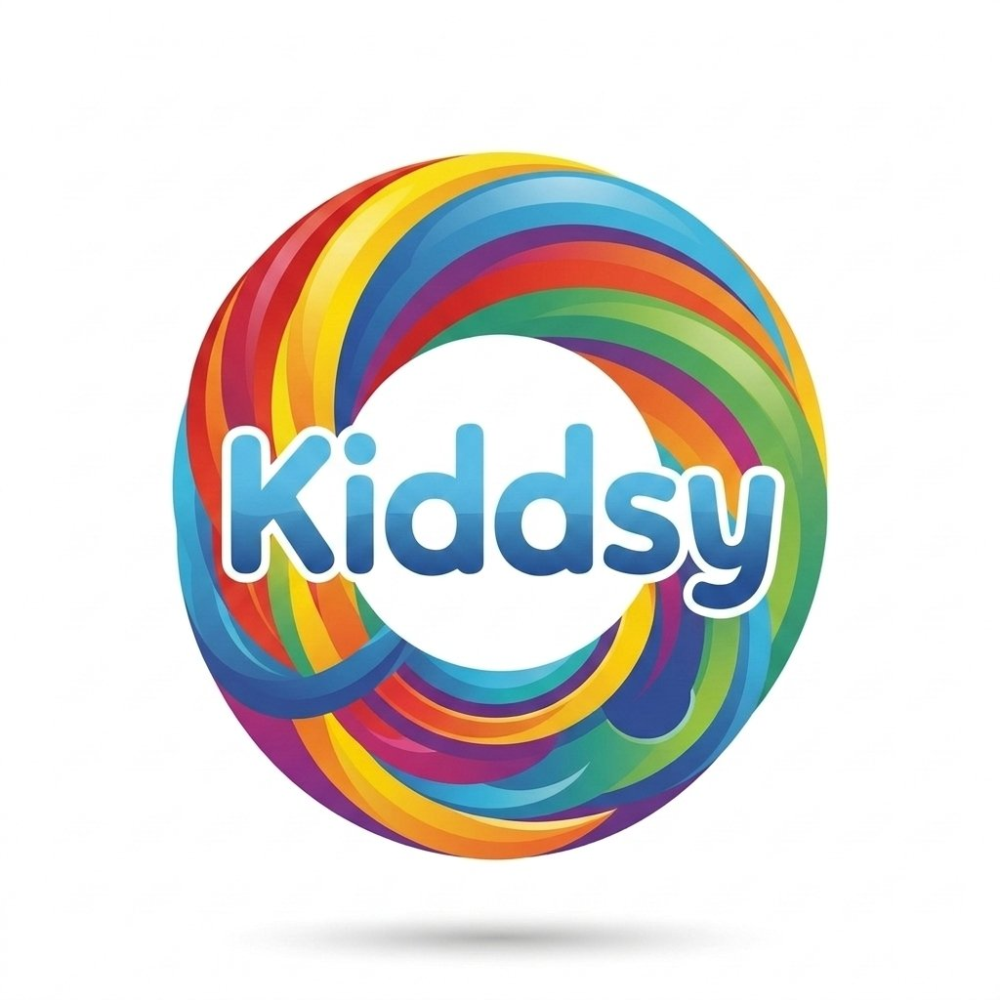

Claro, como CEO de Kiddsy, he preparado un README.md completo y profesional para tu proyecto. Este documento está diseñado para que cualquier desarrollador (incluido tú en el futuro) pueda entender, configurar y desplegar la aplicación sin problemas.

He extraído toda la información clave de tu código y la he estructurado de la siguiente manera:

```markdown
# Kiddsy 🚀 - Aventuras Bilingües con IA

[](https://kiddsy.vercel.app)

**Kiddsy** es una innovadora aplicación web (PWA) diseñada para que las familias aprendan inglés juntas a través de historias mágicas y juegos educativos. Utiliza inteligencia artificial de vanguardia para crear experiencias personalizadas, bilingües y completamente ilustradas.

🔗 **Demo en Vivo:** [https://kiddsy.vercel.app](https://kiddsy.vercel.app)

---

## ✨ Características Principales

*   **Generador de Historias con IA:** Crea cuentos personalizados con el nombre del niño, un tema elegido y en 16 idiomas diferentes.
    *   **Texto:** Utiliza **Groq** (LLaMA 3.3 70B) para generar narrativas fluidas y educativas, transmitidas en tiempo real (SSE).
    *   **Ilustraciones:** Cada página se ilustra con **DALL·E 3**, siguiendo un estilo seleccionado (acuarela, realista, lápiz, etc.).
    *   **Narración:** Escucha la historia con voces realistas de **OpenAI TTS** (nova, onyx, fable, shimmer).
*   **16 Idiomas:** Interfaz y traducciones de historias en: ES, FR, AR, DE, IT, PT, RU, ZH, JA, KO, BN, HI, NL, PL, NO, SV. Soporte RTL para árabe.
*   **Juegos Educativos:** Aprende jugando con:
    *   **Puzzle Master:** Puzzle deslizante con imágenes de animales, ciudades, naturaleza y monumentos. Incluye datos curiosos en 16 idiomas.
    *   **Memory Match:** El clásico juego de memoria con iconos temáticos (animales, comida, espacio, herramientas).
    *   **Word Hunt:** Sopa de letras para encontrar palabras ocultas.
    *   **ABC Explorer:** Aprende el alfabeto, los números y palabras básicas con pronunciación.
*   **Sistema de Cuotas Mensuales:** Control de uso por plan (Free, Plus, Annual, Family, Lifetime) con almacenamiento en memoria (listo para Redis).
*   **Modo Invitado y Cuenta de Usuario:** Almacena tus historias en el dispositivo como invitado o créa una cuenta con **Supabase** para sincronizarlas en la nube.
*   **PWA (Progressive Web App):** Instálala en tu móvil u ordenador para disfrutar de una experiencia nativa, con soporte offline para los assets principales.
*   **Diseño Encantador:** Interfaz colorida, amigable y llena de animaciones suaves con `framer-motion`, diseñada especialmente para niños y familias.

---

## 🛠️ Tecnologías Utilizadas

### Frontend
*   **Framework:** React 18 + Vite
*   **Lenguaje:** JavaScript (ES6+)
*   **Ruteo:** Gestión de estado local y navegación con componentes
*   **Estilos:** Tailwind CSS + CSS Modules
*   **Animaciones:** Framer Motion
*   **Iconos:** Lucide React + SVG personalizados
*   **PWA:** Vite PWA Plugin, Service Worker personalizado (`sw.js`)
*   **Cliente Supabase:** `@supabase/supabase-js`

### Backend (API Routes en Vercel)
*   **Entorno:** Node.js (Serverless Functions)
*   **Framework:** Express.js
*   **IA (Texto):** Groq SDK (`llama-3.3-70b-versatile`)
*   **IA (Imágenes):** OpenAI API (`dall-e-3`)
*   **IA (Voz):** OpenAI API (`tts-1`)
*   **Pagos:** Stripe SDK (Checkout, Webhooks)
*   **Almacenamiento de Cuotas:** In-memory (Map), preparado para Redis.

---

## 📁 Estructura del Proyecto

Una visión general de los directorios más importantes:

```
kiddsy/
├── api/                           # Backend (API Routes de Vercel)
│   ├── server.js                  # Punto de entrada principal: /api/generate-story, /api/tts, etc.
│   └── usageQuota.js              # Lógica de cuotas mensuales (middleware)
│
├── public/                         # Archivos estáticos y PWA
│   ├── sw.js                       # Service Worker personalizado
│   ├── manifest.json                # Manifiesto de la PWA
│   ├── kiddsy-logo.png
│   └── icons/                       # Iconos para PWA (72px - 512px)
│
├── src/
│   ├── main.jsx                     # Punto de entrada de React
│   ├── index.css
│   │
│   ├── context/                      # Contextos de React
│   │   └── AuthContext.jsx            # Autenticación con Supabase
│   │
│   ├── hooks/                         # Custom Hooks
│   │   └── useQuota.js                 # Hook para interactuar con la API de cuotas
│   │
│   ├── utils/                          # Utilidades y configuraciones
│   │   ├── designConfig.js              # Paleta de colores global
│   │   ├── langConfig.js                # Configuración de los 16 idiomas
│   │   ├── EmojiSvg.jsx                  # Renderizador de emojis SVG
│   │   ├── storage.js                    # Helpers para localStorage
│   │   └── ...
│   │
│   ├── data/                            # Datos estáticos
│   │   ├── demoStories.js                 # 3 historias de demostración
│   │   ├── gameData.js                     # Datos para juegos (categorías, iconos)
│   │   ├── navbarTranslations.js           # Traducciones para el menú
│   │   └── ...
│   │
│   ├── components/                      # Componentes reutilizables
│   │   ├── Navbar.jsx
│   │   ├── Footer.jsx
│   │   ├── KiddsyIcons.jsx                # 25+ iconos SVG vectoriales
│   │   ├── KiddsyFont.jsx                  # Componentes de texto estilizados
│   │   ├── Pricing.jsx                      # Planes de suscripción
│   │   ├── QuotaUI.jsx                      # Barra de progreso de cuota
│   │   ├── StripeCheckout.jsx               # Modal de pago con Stripe
│   │   ├── InstallPrompt.jsx                 # Banner para instalar la PWA
│   │   └── ...
│   │
│   └── pages/                            # Vistas principales de la aplicación
│       ├── App.jsx                          # Componente raíz con lógica de navegación
│       ├── HeroScreen.jsx                   # Pantalla de bienvenida
│       ├── StoryGenerator.jsx                # Formulario para crear historias
│       ├── StoryReader.jsx                   # Lector de historias (con TTS y navegación)
│       ├── MyLibrary.jsx                      # Biblioteca personal del usuario
│       ├── Games.jsx                          # Menú principal de juegos
│       ├── PuzzleMaster.jsx                    # Puzzle deslizante
│       ├── MemoryMatch.jsx                      # Juego de memoria
│       ├── WordSearch.jsx                       # Sopa de letras
│       ├── Education.jsx                         # Aprende ABC, números y palabras
│       ├── Subscription.jsx                       # Página de suscripciones
│       └── ...
│
├── index.html                         # Archivo HTML principal (con CSP)
├── vite.config.js                     # Configuración de Vite y PWA
├── tailwind.config.js
├── postcss.config.js
└── vercel.json                        # Configuración para despliegue en Vercel
```

---

## 🚀 Primeros Pasos (Desarrollo Local)

Sigue estos pasos para poner Kiddsy en funcionamiento en tu máquina local.

### Prerrequisitos

*   Node.js (versión 18 o superior recomendada)
*   npm o yarn
*   Una cuenta en [Groq](https://groq.com) para obtener una API Key.
*   Una cuenta en [OpenAI](https://openai.com) para obtener API Keys (DALL·E 3 y TTS).
*   (Opcional) Una cuenta en [Supabase](https://supabase.com) para la autenticación de usuarios.
*   (Opcional) Una cuenta en [Stripe](https://stripe.com) para procesar pagos.

### Instalación

1.  **Clona el repositorio:**
    ```bash
    git clone https://github.com/tu-usuario/kiddsy.git
    cd kiddsy
    ```

2.  **Instala las dependencias:**
    ```bash
    npm install
    # o
    yarn
    ```

3.  **Configura las variables de entorno:**
    Crea un archivo `.env` en la raíz del proyecto (junto a `vercel.json`). Este archivo **nunca debe ser comiteado**. Añade las siguientes variables:

    ```env
    # ===== CLAVES DE API =====
    GROQ_API_KEY="tu_clave_de_groq_aqui"
    OPENAI_API_KEY="tu_clave_de_openai_aqui"

    # ===== STRIPE (Opcional, para pagos) =====
    STRIPE_SECRET_KEY="sk_test_..."
    NEXT_PUBLIC_STRIPE_PUBLISHABLE_KEY="pk_test_..."

    # ===== SUPABASE (Opcional, para cuentas de usuario) =====
    # Encuentra estos valores en la configuración de tu proyecto Supabase
    VITE_SUPABASE_URL="https://tu-proyecto.supabase.co"
    VITE_SUPABASE_ANON_KEY="tu-clave-anon"
    ```

    > **⚠️ Importante para el Frontend:** Las variables que empiezan con `VITE_` son las únicas que estarán disponibles en el código del frontend. Las claves secretas como `GROQ_API_KEY` solo deben usarse en el backend (`/api`).

### Ejecutar en Modo Desarrollo

Kiddsy tiene dos partes que deben ejecutarse simultáneamente para el desarrollo local:

1.  **El Frontend (Vite):**
    ```bash
    npm run dev
    ```
    Esto iniciará el servidor de desarrollo de Vite, generalmente en `http://localhost:5173`.

2.  **El Backend (API de Vercel):**
    Necesitas emular el entorno serverless de Vercel. La forma más fácil es usar la CLI de Vercel:
    ```bash
    # Instalar la CLI de Vercel globalmente (si no la tienes)
    npm i -g vercel

    # Ejecutar el entorno de desarrollo de Vercel
    vercel dev
    ```
    Esto iniciará las funciones de la API en `http://localhost:3000` (o el puerto que indique). Asegúrate de que coincida con la variable `API_BASE_URL` que usa el frontend (en el código se configura automáticamente para usar `localhost:10000` o la URL de producción).

Ahora puedes abrir `http://localhost:5173` y empezar a usar Kiddsy.

---

## 📦 Construcción para Producción

Para crear una versión optimizada para producción:

```bash
npm run build
```

Los archivos estáticos para el frontend se generarán en la carpeta `dist`. Las funciones de la API permanecen en la carpeta `api/`.

---

## ☁️ Despliegue en Vercel

Kiddsy está diseñado para desplegarse sin problemas en **Vercel**.

1.  **Conecta tu repositorio** a Vercel (GitHub, GitLab, Bitbucket).
2.  **Configura las variables de entorno** en el panel de control de Vercel. Añade **todas** las variables que definiste en tu `.env` local.
    *   `GROQ_API_KEY`
    *   `OPENAI_API_KEY`
    *   `STRIPE_SECRET_KEY` (si aplica)
    *   `NEXT_PUBLIC_STRIPE_PUBLISHABLE_KEY` (si aplica)
    *   `VITE_SUPABASE_URL` (si aplica)
    *   `VITE_SUPABASE_ANON_KEY` (si aplica)
3.  **Despliega.** Vercel detectará automáticamente la configuración de `vercel.json` y construirá tanto el frontend como las API routes.

El archivo `vercel.json` ya está configurado para redirigir todo el tráfico a `index.html` (para el enrutamiento del lado del cliente con React) y para mapear las funciones de la API.

---

## ⚙️ Configuración Clave

### Content Security Policy (CSP)

La política de seguridad se define en el `<head>` de `index.html`. Si necesitas ajustarla para nuevos dominios (por ejemplo, un nuevo servicio de IA o análisis), asegúrate de actualizar las directivas `connect-src`, `script-src`, etc.

```html
<meta http-equiv="Content-Security-Policy" content="
  default-src 'self';
  script-src 'self' 'unsafe-inline' 'unsafe-eval' https: http: https://js.stripe.com ...;
  connect-src 'self' https://kiddsy-vercel.onrender.com ws: wss: ...;
  ...">
```

### Service Worker

El archivo `public/sw.js` maneja el comportamiento offline y las actualizaciones de la PWA. Emplea una estrategia de "network-first" para las llamadas a la API y "cache-first" para los assets estáticos.

### Planes y Cuotas Mensuales

Los límites de los planes se configuran en `api/usageQuota.js`. Si necesitas cambiarlos, modifica el objeto `PLAN_LIMITS`.

```javascript
// api/usageQuota.js
export const PLAN_LIMITS = {
  free: 3,
  plus: 15,
  annual: 15,
  family: 25,
  lifetime: 20,
  puzzles_only: 0,
};
```

---

## 🤝 Contribuciones

¡Las contribuciones son siempre bienvenidas! Si tienes ideas para mejorar Kiddsy, por favor:

1.  Haz un fork del proyecto.
2.  Crea una rama para tu feature (`git checkout -b feature/AmazingFeature`).
3.  Haz commit de tus cambios (`git commit -m 'Add some AmazingFeature'`).
4.  Haz push a la rama (`git push origin feature/AmazingFeature`).
5.  Abre un Pull Request.

Por favor, asegúrate de que tu código sigue el estilo general del proyecto y de que todas las funcionalidades existentes siguen funcionando.

---

## 📄 Licencia

Este proyecto está bajo la Licencia MIT. Consulta el archivo `LICENSE` para más detalles.

---

## 📬 Contacto

*   **Email:** [hello@kiddsy.org](mailto:hello@kiddsy.org)
*   **Issues:** [https://github.com/tu-usuario/kiddsy/issues](https://github.com/tu-usuario/kiddsy/issues)

---
**Hecho con ❤️ y ☕ para familias de todo el mundo.**
```